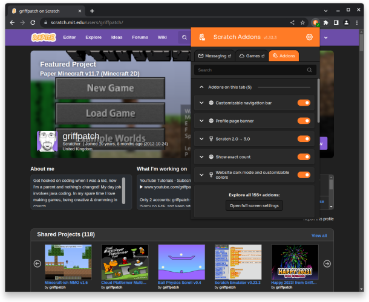

</img>
# Scratch Addons Browser Extension

[](https://chrome.google.com/webstore/detail/fbeffbjdlemaoicjdapfpikkikjoneco)
[](https://chrome.google.com/webstore/detail/fbeffbjdlemaoicjdapfpikkikjoneco)

[](https://chrome.google.com/webstore/detail/fbeffbjdlemaoicjdapfpikkikjoneco)
[](https://addons.mozilla.org/firefox/addon/scratch-messaging-extension/)
[](https://microsoftedge.microsoft.com/addons/detail/scratch-addons/iliepgjnemckemgnledoipfiilhajdjj)
[](https://github.com/ScratchAddons/ScratchAddons/releases)

[](https://github.com/ScratchAddons/ScratchAddons/blob/master/LICENSE)
[](https://discord.gg/R5NBqwMjNc)
[](https://scratchaddons.com)

## About

Scratch Addons combines new and existing features and themes for the [Scratch](https://scratch.mit.edu) website and project editor into one easy-to-access and configurable browser extension. The mission is to provide a centralized, up-to-date platform for community development of new features and themes for Scratch.

<div align="center">



</div>

### What is an addon?

An addon is one or more [userscripts](https://scratchaddons.com/docs/develop/userscripts/) or [userstyles](https://scratchaddons.com/docs/develop/userstyles/) that run on the Scratch website or project editor.

Userscripts can use the `addon.*` JavaScript APIs provided by Scratch Addons, which allows them to obtain Scratch-related information like the currently logged in user and use extension APIs to do things such as send notifications.

Read the [documentation](https://scratchaddons.com/docs/develop/getting-started/addon-basics/) for more information about addons.

### If everything is an addon, what does Scratch Addons do?

Scratch Addons by itself is just an addon loader. Its main tasks are to:

- Allow users to enable, disable and configure addons.
- Run addons and provide APIs to them.
- Provide global state to addons (for example, the `addon.auth` API).
- Pollute prototypes for use by addon userscripts.
- Provide ways to access and modify Redux state.
- Avoid addons from interfering with each other.
- Avoid duplicate work from different addons.

### Addons outside of Scratch Addons itself

Other extensions and even forks of Scratch can also provide their users with most addons from Scratch Addons, as long as a compatibility layer for `addon.*` and other parts of the addon loader are present. A notable example is the [TurboWarp](https://github.com/TurboWarp/scratch-gui/tree/develop/src/addons) editor. These also inherit translations from the Scratch Addons project.

### Structure

- `.github`: GitHub templates, workflows and contributing files.
- `_locales`: Translations for everything except addons strings.
- `addons-l10n`: Translations for strings added to the website by addons. Each addon has its own file.
- `addon-api`: The `addon.*` JavaScript APIs.
- `addons`: The addons themselves. Each addon has it own directory with an addon manifest and an entry in `addons.json`.
- `background`: Background scripts for handling things such as addon settings.
- `content-scripts`: The main extension script (cs.js) and addon injector. A few non-togglable things are also included in `cs.js`
- `images`: Logos, screenshots and icons. Images used only by addons go in that addon's directory instead.
- `libraries`: Third-party libraries and libraries for handling things such as  the global theme.
- `popups`: The code for popup addons, excluding the addons tab. The addon manifests for popup addons are still located in the `addons` directory.
- `webpages`: The settings page, popup and addons tab.

## Installation

Building is not required unless working with the settings page. The best way to download the source is with Git:

```sh
git clone https://github.com/ScratchAddons/ScratchAddons.git
```

For other installation methods and browser support, check [the documentation](https//scratchaddons.com/docs/getting-started/installing).

### Loading the extension (Chrome)

To load the extension into most Chromium-based browsers, go to `chrome://extensions`, turn on developer mode, click "Load unpacked" and select the `ScratchAddons` folder.

### Loading the extension (Firefox)

Go to `about:debugging` select "This Firefox", click "Load Temporary Add-on..." and select the `manifest.json` file in the `ScratchAddons` folder.

> **Note**
> Firefox extensions loaded this way are removed when the browser is closed.

### Building the settings page

To setup the Settings page for development run these commands in the `webpages` directory:

```sh
npm install
npm run dev
```

See [/webpages/README.md](https://github.com/ScratchAddons/ScratchAddons/tree/master/webpagess#readme) for more information about settings page development.

## Contributing

### Suggestions and bug reports

If you found a bug or have a suggestion [create an issue](https://github.com/ScratchAddons/ScratchAddons/issues/new/choose) after checking for duplicates.

### Code

Before contributing code, please read our [contributing guidelines](https://github.com/ScratchAddons/ScratchAddons/blob/master/.github/CONTRIBUTING.md).

We recommend using Visual Studio Code as the code editor.

### Translations

Translations are handled by [Transifex](https://www.transifex.com/). If you are interested in translating the extension, read [Joining the Localization Team](https://scratchaddons.com/docs/localization/joining-the-localization-team/).

### Documentation

Most documentation is located in the [website-v2](https://github.com/ScratchAddons/website-v2) repository in [/content/docs](https://github.com/ScratchAddons/website-v2/tree/master/content/docs) as markdown files.

## License

Scratch Addons is licensed under the terms of the [GNU General Public License v3.0](https://github.com/ScratchAddons/ScratchAddons/blob/master/LICENSE).

Other third-party libraries used are listed on [/libraries/README.md](https://github.com/ScratchAddons/ScratchAddons/tree/master/libraries#readme).
