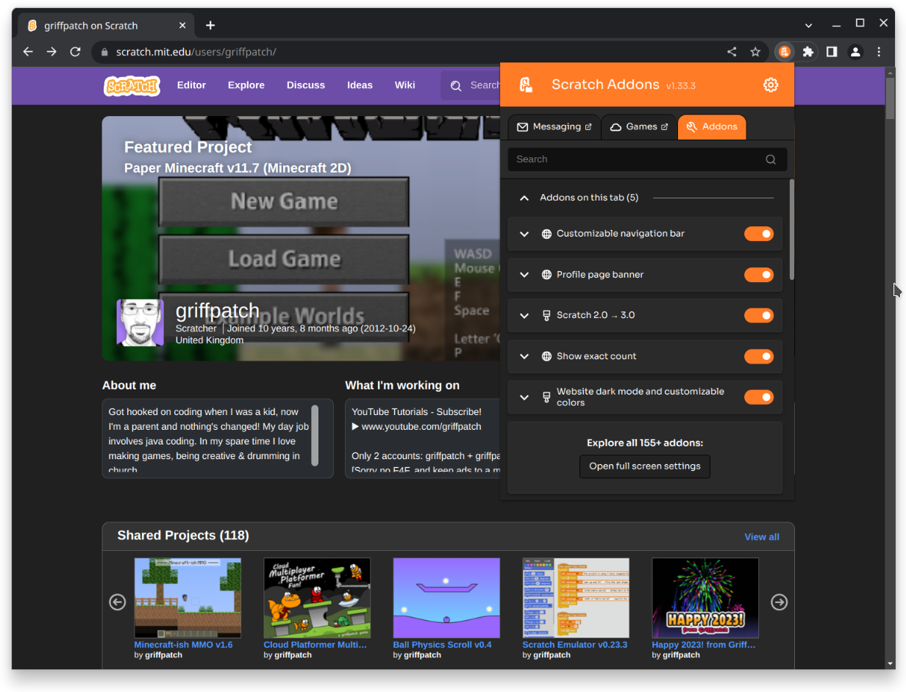

</img>
# Scratch Addons browser extension

[](https://chrome.google.com/webstore/detail/fbeffbjdlemaoicjdapfpikkikjoneco)
[](https://chrome.google.com/webstore/detail/fbeffbjdlemaoicjdapfpikkikjoneco)
[](https://microsoftedge.microsoft.com/addons/detail/iliepgjnemckemgnledoipfiilhajdjj)

   

[](https://github.com/ScratchAddons/ScratchAddons/blob/master/LICENSE)
[](https://discord.gg/R5NBqwMjNc) [](https://scratchaddons.com)

</img>

## About

Scratch Addons combines new and existing features and themes for the Scratch website and project editor into one easy-to-access and configurable browser extension. The mission is to provide a centralized, up-to-date platform for community development of new features and themes for Scratch.

### What is an "addon"?

An addon is similar to an extension or a userscript, but they use special APIs provided by the Scratch Addons extension. These APIs allow addons to run scripts on a Scratch page (userscripts) or apply styles to the Scratch website (userstyles).

Userscripts can use the `addon.*` JavaScript APIs, which allow them to obtain Scratch-related information (for example, get the current logged in user) and also use extension APIs (like sending notifications).

Converting an existing extension or userscript into an addon, or writing your own, is very easy. [Check out the guide](https://scratchaddons.com/docs/develop/getting-started/creating-an-addon/).

### If everything is an addon, what does Scratch Addons do?

Scratch Addons by itself is just an addon loader. Its main tasks are to:

- Allow users to enable, disable and configure addons.
- Run addons and provide APIs to them.
- Provide global state to addons (for example, the `addon.auth` API).
- Pollute prototypes for use by addon userscripts.
- Provide ways to access and modify Redux state.
- Avoid addons from interfering with each other.
- Avoid duplicate work from different addons.

### Addons outside of Scratch Addons itself

Other extensions (and even forks of Scratch) can also provide their users with most addons from Scratch Addons, as long as a compatibility layer for `addon.*` and other parts of the addon loader is present. A notable example is the [TurboWarp](https://github.com/TurboWarp/scratch-gui/tree/develop/src/addons) editor. These also inherit translations from the Scratch Addons project.

## Install

No build is required, just download the source and load it into a web browser.


```
git clone https://github.com/ScratchAddons/ScratchAddons.git
```

For other installation methods and browser support, check [the documentation](https//scratchaddons.com/docs/getting-started/installing).

### Loading the extension (Chrome)

Use this method on Microsoft Edge, Opera, Brave, Vivaldi and other Chromium-based browsers.

1. Type `chrome://extensions` into your address bar to open the Extension Management page.
2. Enable the Developer Mode toggle in the top-right corner.
3. Click the `Load unpacked` button on the top and select the extension folder which has the `manifest.json` file in it. 

### Loading the extension (Firefox)
1. Type `about:debugging` into the address bar to open the debugging page by typing it into your address bar.
2. Click `This Firefox` on the left-hand menu.
3. Click `Load Temporary Add-on...` and select the `manifest.json` file.

## Contribute

If you found a bug, or want to suggest new features, please open an [issues](https://github.com/ScratchAddons/ScratchAddons/issues/new). If you want to help with the code or add a new addon, fork this repository, and then create a [pull request](https://github.com/ScratchAddons/ScratchAddons/pulls). Also, please read our [contributing guidelines](https://github.com/ScratchAddons/ScratchAddons/blob/master/.github/CONTRIBUTING.md).

## License

Scratch Addons is licensed under the terms of the [GNU General Public License v3.0](https://github.com/ScratchAddons/ScratchAddons/blob/master/LICENSE).

Other third-party libraries used are listed on [/libraries/README.md](https://github.com/ScratchAddons/ScratchAddons/tree/master/libraries#readme).
